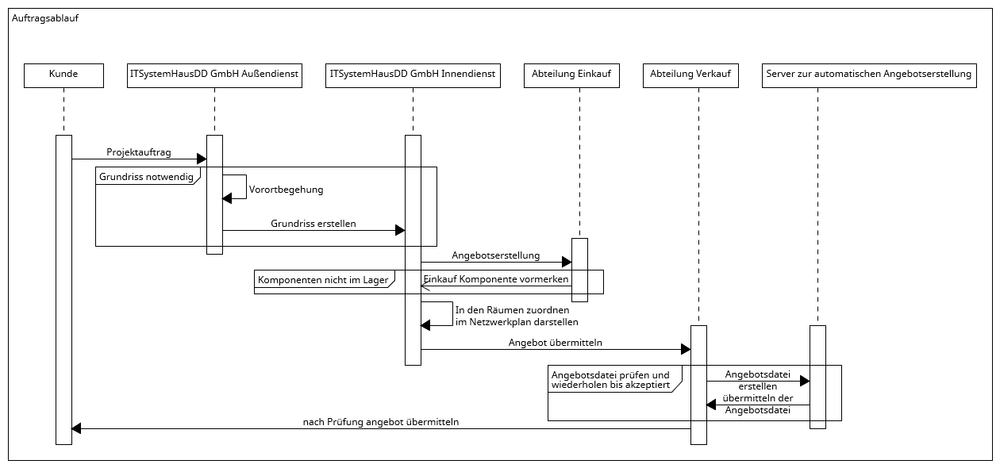

# softwaredd
## Dokumentation
Eine online Dokumentation ist unter *http://webserver.steppencloud.de* abrufbar.<br>
Als Backup dient diese *README*.
### Beteiligte des Geschäftsprozesses
- ITSystemhausDD GmbH Außendienst
- ITSystemhausDD GmbH Innendienst
- Abteilung Einkauf
- Abteilung Verkauf
- Server zur automatischen Angebotserstellung 
### Zielplatform für die Softwarentwicklung
- Linux weil:
  - sehr einfaches Arbeiten mit Python
  - Opensource
  - Ressourcensparend
### Vergleich von Python mit C#
#### Vorteile Python:
- dynamische Typisierung, welche auch statisiert werden kann
- Erfahrungen der Entwickler
- einfacher Datenbankzugriff über <code>SqlAlchemy</code>
- Funktioniert auf allen gängigen Betriebssystemen
- wenig Klickibunti
- Syntax

#### Vorteile C#:
- viel Klickibunti
- statische Typisierung

#### Nachteile C#:
- nur mit Windows kompatibel
- umständliches Einbinden von Datenbanken

### Use-Case-Diagramm

[Use-Case Diagramm PDF](use-case.pdf)

### Sequenzdiagramm

[Sequenzdiagramm PDF](Sequenzdiagramm.pdf)
### Webserver
Einrichtung einer Webseite auf einem Raspberry Pi 4
- Software: Apache2
- eingetragene Domäne für das Raspberry Pi
- erstellte Subdomäne für die Webseite
- benötigte html-, css-, script-Ordner auf dem Raspberry Pi

#### Konfiguration vHost

```bash
	$ mkdir /var/www/webserver
	$ chown -R www-data:www-data /var/www/webserver
	$ chmod -R 755 /var/www/webserver
	$ nano /etc/apache2/sites-available/wiki.conf
	$ cp -r /PFAD/ZU/HTML-DATEIEN/ /var/www/webserver
```
```html
  <VirtualHost *80>
	  DocumentRoot /var/www/html/wiki
	  ErrorLog ${APACHE_LOG_DIR}/error.log
	  CustomLOG ${APACHE_LOG_DIR}/access.log combined
  </VirtualHost>
```
    $ a2ensite wiki.conf <br>
	  $ systemctl restart apache2.service

Aufsetzen eines Servers über VMware Workstation Player 16
- OS: Debian 11
- Benutzername: user
- Passwort: ******
- IP-Adresse: 192.168.72.129
- Software: Apache2 
- Ordner: /var/www/html/wiki
- Step-by-Step
```bash
  $ apt install apache2
  $ systemctl start apache2
  $ mkdir /var/www/html/wiki
  $ chown -R www-data:www-data /var/www/html/wiki
  $ chmod -R 755 /var/www/html/wiki
  $ nano /var/www/html/wiki/index.html
```
```html
  <html>
    <body>
      <p> Freunde der guten Unterhaltung, es funktioniert!</p>
    </body>
  </html>

```
```bash
  $ nano /etc/apache2/sites-available/wiki.conf
```
```html
  <VirtualHost *80>
	  DocumentRoot /var/www/html/wiki
	  ErrorLog ${APACHE_LOG_DIR}/error.log
	  CustomLOG ${APACHE_LOG_DIR}/access.log combined
  </VirtualHost>
```
```bash
  $ a2ensite wiki.conf
  $ rm /etc/apache2/sites-enabled/000-default.conf
```

### Notwendige Daten 
1. Identifizieren Sie notwendige Daten, die als Voraussetzung für die Angebotserstellung dienen.
    - *Grundriss*
    - *IT-Komponenten/Hardware*

2. Analysieren Sie die Datenquellen hinsichtlich der der Bereitsteller/Orte und möglicher Datenformate in denen diese bereitgestellt werden können.
    - *Grundriss*:
        - *kann vom Kunden bereitgestellt werden als:*
            - *.pdf (Konvertierung in .step erforderlich)*
            - *.[Bildformat] (Konvertierung in .step erforderlich)*
            - *auf Papier (Konvertierung in .step erforderlich)*
            - *.step*
            - *andere 3D/2D-Formate (Konvertierung in .step erforderlich)*
        - *wenn kein Grundriss vorhanden:*
            - *Erstelllung vom Mitarbeiter im .step Format*
    - *Hardware*:
        - *wenn Modell vorhanden, dann als .step aus Datenbank*
        - *wenn Modell nicht vorhanden, dann .step erstellen*
        - *Technische Daten als Tabellenformat (muss in DB integriert werden)*


3. Untersuchen Sie die Datenformate/Datenquellen im Detail
    - a) welche Daten werden dargestellt
      
        - *Grundriss dargestellte Daten: Fläche, Längen, Flächenverteilung (z.B. Kanten), Anschlüsse (Steckdosen, Wasser), Stromleitungen (wenn Glück), Öffnungen (Türen, Fenster), Schrägen*
        - *Hardware: Größe, Gewicht, Kabellänge, Stromverbrauch (Sicherungsschutz), Arbeitsplatzergonomie (Beleuchtung, Klima)*
        

    - b) wie werden Daten in den Datenquellen dargestellt
    
        *CAD-Format*
        1.	*Grundriss:*
            - *.step*
        2.	*Hardware*
            - *.step*

    - c) wie können diese importiert und sinnvoll weiterverarbeitet werden
        - *In .pdf abspeichern*
        - *STEPutils als Python libary*
    - d) welche Metainformationen sind zur Datenquelle vorhanden


4. Entscheiden Sie, wer die Daten innerhalb der ITSystemHausDD GmbH nutzen und verarbeiten darf.
    - *ITSystemHausDD GmbH Innendienst*
      - *interne Anwendungsentwickler*
    - *Abteilung Einkauf*
      - *benötigt lediglich Zugriff auf die Daten der IT-Komponenten*
    - *Abteilung Verkauf*
      - *benötigt Zugriff auf alle Daten, die zur Angebotserstellung notwendig sind*

5. Entscheiden Sie sich für ein Datenformat für das Angebot.
  - *.step weil:*
    - *existierende Python libary*
    - *kann mit kostenloser opensource Software erstellt und bearbeitet werden*
